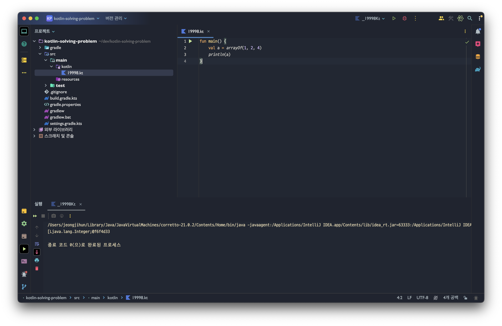

## ✔ 코틀린으로 알고리즘 풀이?

그동안 간결한 문법으로 빠르게 풀기위해 파이썬으로 풀이했었다.(당시에 파이썬이 가장 익숙해서 시작했던 것도 있음)

풀이할때 사고력 싸움이기에 어떤 언어로 풀이하든 상관없다고 생각한다

그래서! 앞으로 코틀린으로 한번 풀이해보려고 한다(뜬금 ㅋㅋㅋ)  

간단한 이유..👇
> 웹 개발하는데 있어서 코틀린을 사용하기 시작하기도 했고,  
> 파이썬 타입선언이 부족한 점(물론 명시는 할 수 있음..),  
> 그리고 코드가 길어지고 복잡한 문제풀이 과정에서 변수값에 대한 실수를 너무 많이 하는 것 같아서 불변타입이나 null안전성등을 지원해주는 코틀린으로 풀이해볼 까 한다.(+ 코틀린이 지원해주는 간결하고 우아한 문법들도 덤!!)


<br><br><br>

## ✔ java와의 차이
java에서는 JRE를 통해 java.util.*안에 들어있는 기본 클래스를 사용할 수 있게 해준다.
하지만 kotlin에서는 그렇지 못하다.
그래서 빌드할 때 각종 라이브러리를 묶은 array.jar라는 패키지 파일을 함께 생성하여 코틀린 기본 라이브러리를 지원한다.


위에보면 array.jar를 생성하도록 조취를 취하지 않았지만 arrayOf를 사용할 수 있다. gradle 환경에서 알아서 빌드해주기 때문이다.
문제풀이를 해야하니까 백준, 프로그래머스, 리트코드등의 사이트에서 kotlin 소스코드를 어떻게 빌드하는지 확인해보고 문제풀이하면 좋을 것 같다.


<br><br><br>

## ✔ 문제풀이 하면서 유용한 문법을 모아보자(계속 업데이트)

#### 💡 함수형 스타일
- java의 stream과 다르게 문법이 간결  
- it 지원  
- toList()를 붙이지 않아도됨
- 주의점 : ( ) 괄호가 생략된 { } 사용법에 헷갈리지 말자
```kotlin
members
    .filter { it.age = 10 }
    .map { it.name }
    .sorted()
```

<br><br>
---

#### 💡 ???


<br><br>
---


[참고]
https://product.kyobobook.co.kr/detail/S000209071463

<br><br><br>